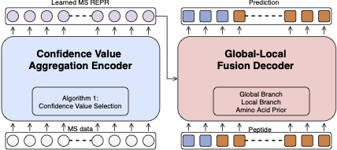

# DPST : De Novo Peptide Sequencing with Amino-Acid-Aware Transformers - Pytorch Implementation


## Dependency
* python 3.9.4
* torch  1.9.1+cu111
* cuda 11.2.1
* NCLL
* gcc 9.3.0
* pytorch_lightning 1.5.7
* pytorch3d 0.6.0
* [cosine_annealing_warmup](https://github.com/katsura-jp/pytorch-cosine-annealing-with-warmup)

## Dataset
* [DeepDenovo dataset](https://github.com/nh2tran/DeepNovo) 
* [SMSNet dataset](https://github.com/cmb-chula/SMSNet)

We follow the same data preprocessing pipline as [PointNovo](https://github.com/volpato30/DeepNovoV2)


## Train DPST

* Please run `main.py`, while set the parameters properly. e.g. `python3 main.py --local_attn --global_attn  --value_attn --first 4 --ape --output f0e --fold 0 --batch 16 --gpus 4 --workers 2 --prefix ENTER_PATH_TO_YOUR_DATASET`
* It takes 30m - 50m for constructing knapsack_file when running for a first time.

```bash
python main.py --help

--fold                                 #Select training fold
--epoch                                #Max training epochs
--gpus                                 #Number of GPUs to use
--acce                                 #ddp or dp
--val_interval                         #Frequency for evaluation
--profiler                             #Please select a pytorch_lightning profiler
--lr                                   #learning rate
--verbose_step                         #Frequency of updating trainning log
--weight_decay                         #Weight decay
--hidden                               #Number of hidden units
--heads                                #Number of Attention heads
--factor                               #FFD expansion factor
--layers                               #Number of layers
--batch                                #Batch Size
--workers                              #Number of dataLoader workers  
--checkpoints                          #Path to resume from checkpoints
--local_attn                           #Use local branch
--global_attn                          #Use global branch
--value_attn                           #Use confidence value aggregation
--output                               #Save director
--save_memory                          #Save gpu memory vs. speeding update calculation
--ape                                  #Use abosulte postional embedding or relative positonal embedding
--kq                                   #Knn for encoder self-attention
--kv                                   #Number of spectra used for confidence value aggregation
--down                                 #Downsampling hidden units for global branch
--first                                #Number of local branches used
--prefix                               #Prefix path to load data
``` 


## Code for Related Work
* DeepDenovo: https://github.com/nh2tran/DeepNovo
* SMSNet: https://github.com/cmb-chula/SMSNet
* PointNovo: https://github.com/volpato30/DeepNovoV2
* Transformer: https://github.com/jadore801120/attention-is-all-you-need-pytorch
* Point Transformer: https://github.com/lucidrains/point-transformer-pytorch
* DGCNN: https://github.com/WangYueFt/dgcnn

## Todo

- [ ] Upload pretrained checkpoints
- [ ] Upload testing script for PSM in diffirent organizations

## Notice
Code is only tested on x86_64 x86_64 x86_64 GNU/Linux

## License
The dataset loading is based on PointNovo's implementation: https://github.com/volpato30/DeepNovoV2

The model architecture is based transformer: https://github.com/jadore801120/attention-is-all-you-need-pytorch and https://github.com/lucidrains/vit-pytorch


